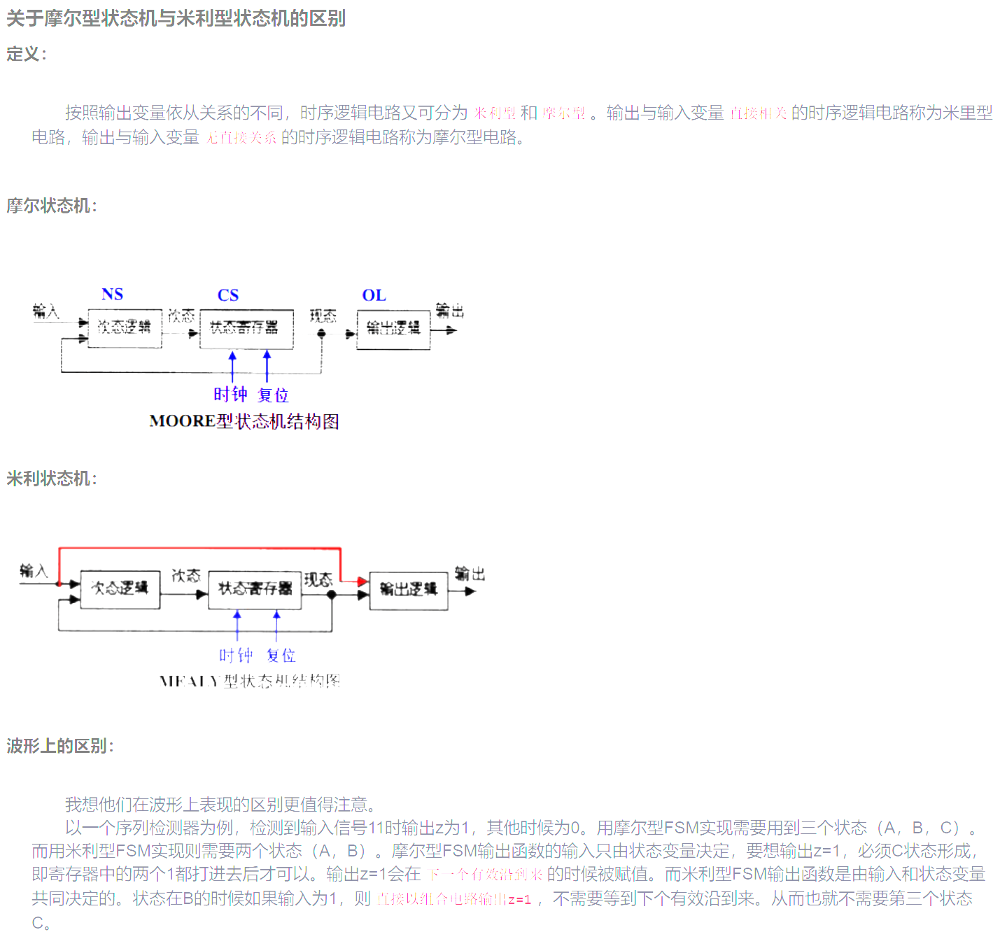
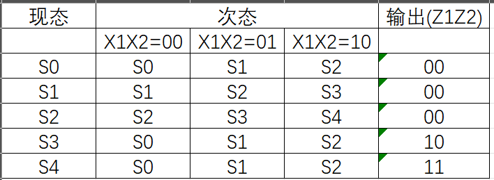
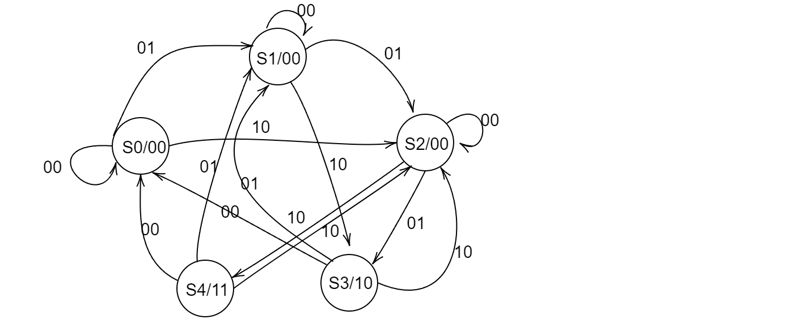

# 引例

我们以一个例子（该例子出自陈光梦数字电路教材）来说明 fsm 的分析并写出 verilog 代码

假定有某种自动售卖饮料机。可以投入1元或5角的硬币，饮料1.5元一杯。当先后投入的硬币满1元5角后，机器自动送出一杯饮料；当投入的硬币满2元后，机器除了送出一杯饮料外，还送出一枚5角硬币找零。

# 米利机与摩尔机

1. Moore型的输出只与当前状态有关，而Mealy型的输出还与输入相关。
2. 在实现相同功能的情况下,Mealy型状态机所需要的状态数比Moore型少，Moore需要待状态稳定才输出。

3. 输出时序上，Moore状态机同步输出，Mealy状态机异步输出；

4. 输出变化上，Mealy状态机比Moore状态机领先一个时钟周期；

# 以摩尔机为例分析

## 1.具体分析

（1) 考察输出：输出的饮料和找零。用 Z1=1 表示输出饮料，用 Z2=1 表示输出找零。输出情况：(Z1Z2=00,10,11) 3 种

（2）考察系统状态：系统状态是记忆已经投入的硬币币值。已经投入的硬币总数为 0，0.5，1，1.5，2元，5种情况。用 S0,S1,S2,S3,S4来表示

（3）考察输入：输入有3种情况：投入 0，0.5，1元，用X1X2=(00,01,10)来表示，X1X2=11是禁止项。

在状态 S0，系统记忆的是已经投入 0 元。

​	若 X1X2=00，表示没有投币，机器应该保持S0状态不变，

​	若 X1X2=01，表示投入0.5元，机器应该记忆”已输入5角“，机器应该进入状态S1，

​	若X1X2=10，表示投入1元，机器应该记忆"已输入1元"，机器应该进入状态S2，

​	在S0状态下没有输入，Z1Z2=00

在状态 S1，系统记忆的是已经投入 0.5 元。

​	若X1X2=00,表示没有投币，机器应该保持 S1 状态不变，

​	若X1X2=01,表示投入0.5元，机器应该记忆”已输入1元“，机器应该进入状态S2，

​	若X1X2=10，表示投入1元，机器应该记忆"已输入1.5元"，机器应该进入状态S3，

​	在S1状态下没有输出，Z1Z2=00

在状态 S2，系统记忆的是已经投入 1 元。

​	若X1X2=00，表示没有投币，机器应该保持 S2 状态不变，

​	若X1X2=01，表示投入0.5元，机器应该记忆”已输入1.5元“，机器应进入S3

​	若X1X2=10，表示投入1元，机器应该记忆”已输入 2 元“，机器应进入S4

​	在S1状态下没有输出，Z1Z2=00

在状态 S3，系统记忆的是已经投入 1.5 元。

​	在 S0 状态下输出一杯饮料，Z1Z2=10

​	若X1X2=00, 表示没有投币，机器应进入 S0

​	若X1X2=01, 表示投入0.5元，机器应该记忆”已输入0.5元“，机器应该进入状态S1，

​	若X1X2=10, 表示投入1元，机器应该记忆"已输入1元"，机器应该进入状态S2，

在状态 S4，系统记忆的是已经投入1元。

​	在 S4 状态下输出1杯饮料和找零，Z1Z2=11；

​	若X1X2=00，表示没有投币，机器应进入S0

​	若X1X2=01，表示投入0.5元，机器应该记忆”已输入0.5元“，机器应进入S1

​	若X1X2=10，表示投入1元，机器应该记忆”已输入1元“，机器应进入S2

## 2. 状态表

## 3.状态图

# 4. verilog

状态机三种写法