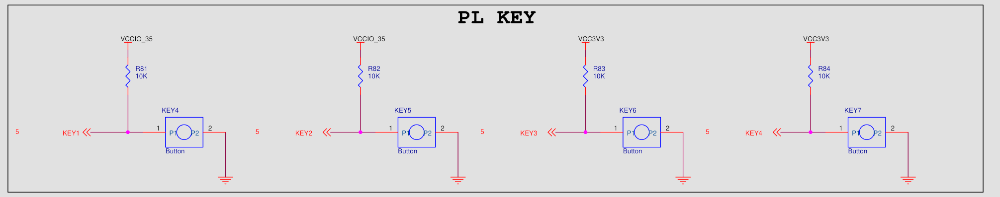
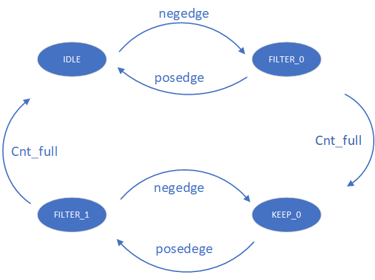

按键：key

按下为 0 ，不按为 1。

按键有 四种状态(key_state)

* 维持为 1:  没有跳变，计数器关闭
* 1 到 0 滤波：出现从 1 到 0 的跳变，计数器开始计数，判断突刺是否大于 50ms ，若是，跳变为 0， 否：回到 1
* 维持为 0：计数器关闭
* 0 到 1 滤波：出现从 0 到 1 的跳变，计数器开始计数，判断突刺是否大于 50ms ，若是，跳变为 1， 否：回到 0

状态转换图：

