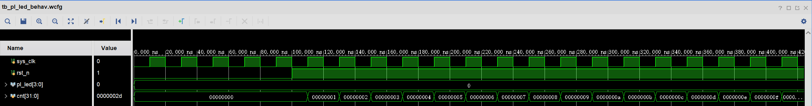
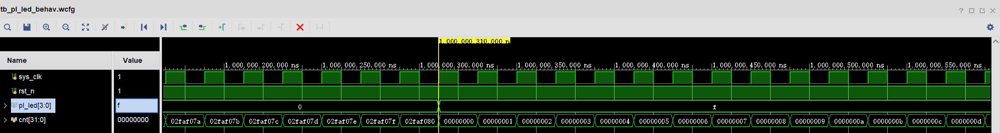

# 1.实验背景
这是 Xilinx FPGA 开发的一个实验记录

如果你想深入 Xilinx FPGA，需要常查看 Xilinx UG ,Xilinx 提供了 DOCNAV 程序来管理手册。

# 2.实验目的
1.  学习基本的 verilog 语法
2.  学习 Vivado 的 gui 流程
3.  点亮 led


# 3. 实验原理

时钟频率为 50MHz, 计数器从 0 到 49_999_999 为 50 个周期
在第 cnt = 49_999_999 的下一个时钟沿，led 跳变。

# 4. 实验过程
输入：rst_n, 
    en ,

输出：led;

```verilog
module pl_led(
    input sys_clk,
    input rst_n,
    output [3:0] pl_led
);

reg [3:0] pl_led_reg;
reg [31:0] cnt;

always @(posedge sys_clk or negedge rst_n) begin
    if(!rst_n) begin
        cnt <= 32'd0;
        pl_led_reg <= 4'd0;
    end
    else if(cnt <= 32'd49_999_999) begin
        pl_led_reg <= pl_led_reg;
        cnt <= cnt + 32'd1;
    end
    else begin
        cnt <= 32'd0;
        pl_led_reg <= ~pl_led_reg;
    end
end

assign pl_led = pl_led_reg;

endmodule
```

编写仿真激励，测试 pl_led


```verilog
`timescale 1ns/1ns

module tb_pl_led;

reg sys_clk;
reg rst_n;
wire [3:0] pl_led;

pl_led uut(
    .sys_clk(sys_clk),
    .rst_n(rst_n),
    .pl_led(pl_led)
);
// create clock
always #10 sys_clk = ~sys_clk;
initial begin
    sys_clk = 0;
    rst_n = 0;
    #100;
    rst_n = 1;
    #100; //rst_n negedge
    rst_n = 0;
    #100;
    rst_n = 1;
end
endmodule
```

若要下载 bitstream 还需要，约束文件
```tcl
set_property PACKAGE_PIN J16 [get_ports pl_led[3]]
set_property PACKAGE_PIN K16 [get_ports pl_led[2]]
set_property PACKAGE_PIN M15 [get_ports pl_led[1]]
set_property PACKAGE_PIN M14 [get_ports pl_led[0]]
set_property PACKAGE_PIN N15 [get_ports rst_n]
set_property PACKAGE_PIN U18 [get_ports sys_clk]
set_property IOSTANDARD LVCMOS33 [get_ports pl_led[3]]
set_property IOSTANDARD LVCMOS33 [get_ports pl_led[2]]
set_property IOSTANDARD LVCMOS33 [get_ports pl_led[1]]
set_property IOSTANDARD LVCMOS33 [get_ports pl_led[0]]
set_property IOSTANDARD LVCMOS33 [get_ports rst_n]
set_property IOSTANDARD LVCMOS33 [get_ports sys_clk]

create_clock -period 20.000 -name sys_clk -waveform {0.000 10.000} [get_ports sys_clk]
```

# 5. 结果与总结

vivado 仿真：

1. rst_n 退出复位的下一个时钟沿，开始计数。



2. rst_n 下降沿，异步置 0


3. 计数到 49_999_999 下一个上升沿：计数器清 0 ，输出翻转。



综合、布局布线、bitstream 生成、下载


# 6. 注意事项

1.设置仿真时间
参考
https://hitsz-cslab.gitee.io/diglogic/vivado/%E4%BB%BF%E7%9C%9F%E8%B0%83%E8%AF%95/

2.若 tb 在 design source 而不是 simulation source ，需要移除。

# 7. 不足与改进


# 8. 参考文献/进一步阅读

